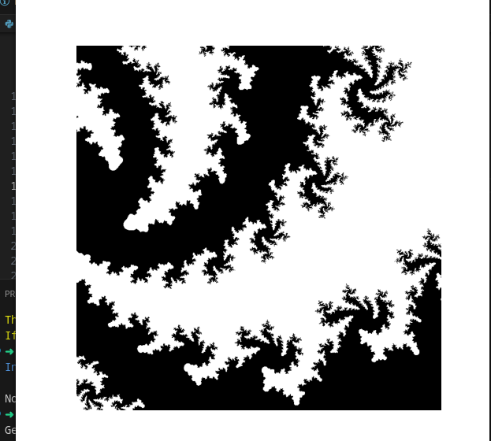

# Fractal Explorer

This project visualizes Mandelbrot and Julia sets with interactive zooming capabilities, high precision calculations, and performance optimizations.



- **Dynamic Fractal Generation:** Randomly generates either a Mandelbrot set (10% chance) or a Julia set (90% chance) each time the program starts.
- **High Precision Zoom:** Utilizes the `gmpy2` library for arbitrary-precision floating-point arithmetic, allowing for deep and detailed zooms without precision loss.
- **Performance Optimized:** Leverages `numba` to compile critical fractal calculation functions for improved performance.
- **Edge-Following Zoom:** The animation automatically zooms into the most detailed regions (edges) of the fractal, ensuring interesting visual exploration.
- **Binary Color Scheme:** Displays fractals in a stark black and white binary scheme, with the inside of the set being black and the outside being white, with no color transitions.
- **High Resolution:** Generates fractal images at 800x800 pixels for enhanced detail.
- **Interactive Controls:**
    - Press the **left arrow key** or **right arrow key** to reset the zoom and generate a new random fractal.

## How it Works

The program uses the mathematical definitions of Mandelbrot and Julia sets.

- **Mandelbrot Set:** For each pixel, it tests a complex number `c` by iterating `z = z^2 + c` starting with `z=0`. If `z` remains bounded, the point `c` is in the set (colored black). Otherwise, it's outside (colored white).
- **Julia Set:** Similar to Mandelbrot, but `c` is a fixed constant for the entire fractal, and the pixel coordinates define the initial `z` value.
- **Precision:** `gmpy2` is used for all coordinate transformations and zoom calculations to maintain accuracy at extreme zoom levels.
- **Performance:** `numba`'s `@jit` decorator compiles the core iteration functions (`mandelbrot` and `julia`) to highly optimized machine code.
- **Edge Detection:** The `find_most_detailed_region` function identifies interesting points on the fractal's edge by finding points that diverge with the highest iteration count and are furthest from the current view's center, ensuring the animation stays focused on complex areas.
- **Coloring:** The `mandelbrot` and `julia` functions return `0.0` for points inside the set and `1.0` for points outside, which are then mapped to black and white respectively.

## Installation

To run this project, you need to have [Poetry](https://python-poetry.org/docs/#installation) installed.

1. **Clone the repository (if applicable):**
   ```bash
   git clone git@github.com:WillMeyburgh/fractals.git
   cd fractals
   ```

2. **Install dependencies using Poetry:**
   ```bash
   poetry install --no-root
   ```

## Usage

To run the fractal explorer, execute the `main.py` script using Poetry:

```bash
poetry run python main.py
```

- The animation will start automatically, zooming into a randomly selected Mandelbrot or Julia set.
- Press the **left arrow key** or **right arrow key** on your keyboard to reset the zoom and generate a new random fractal.
# fractals
